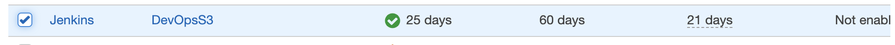
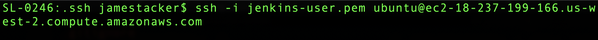
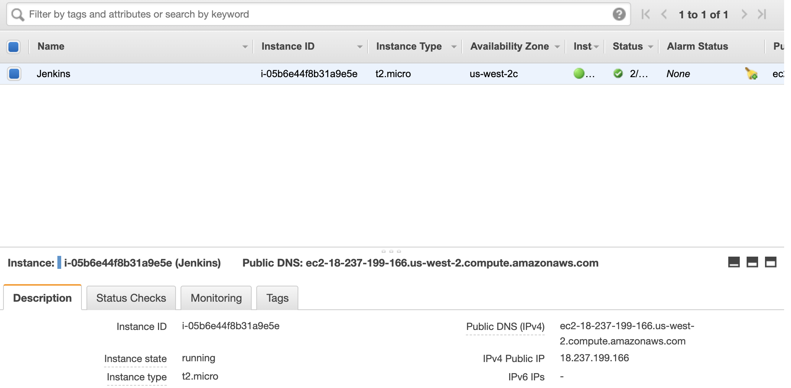
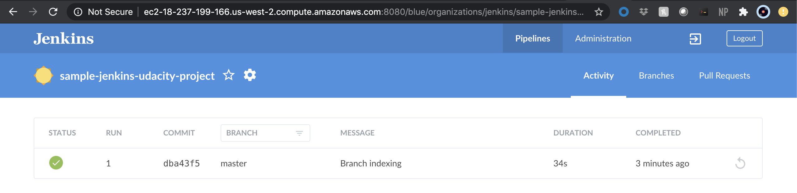
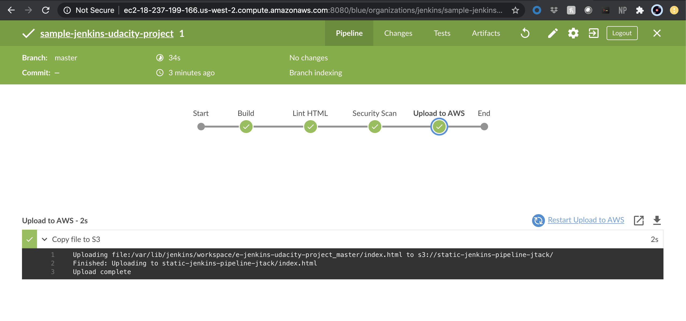
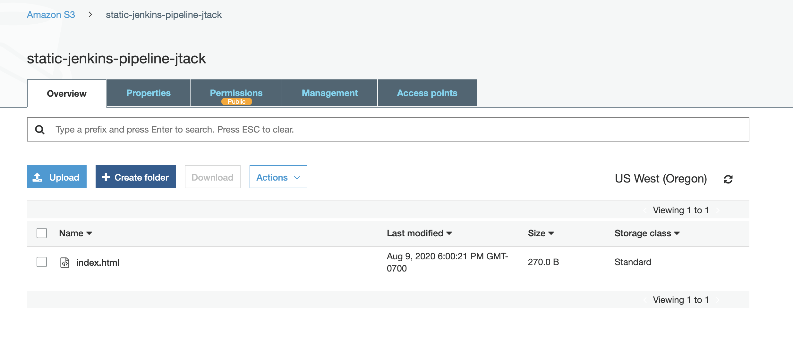
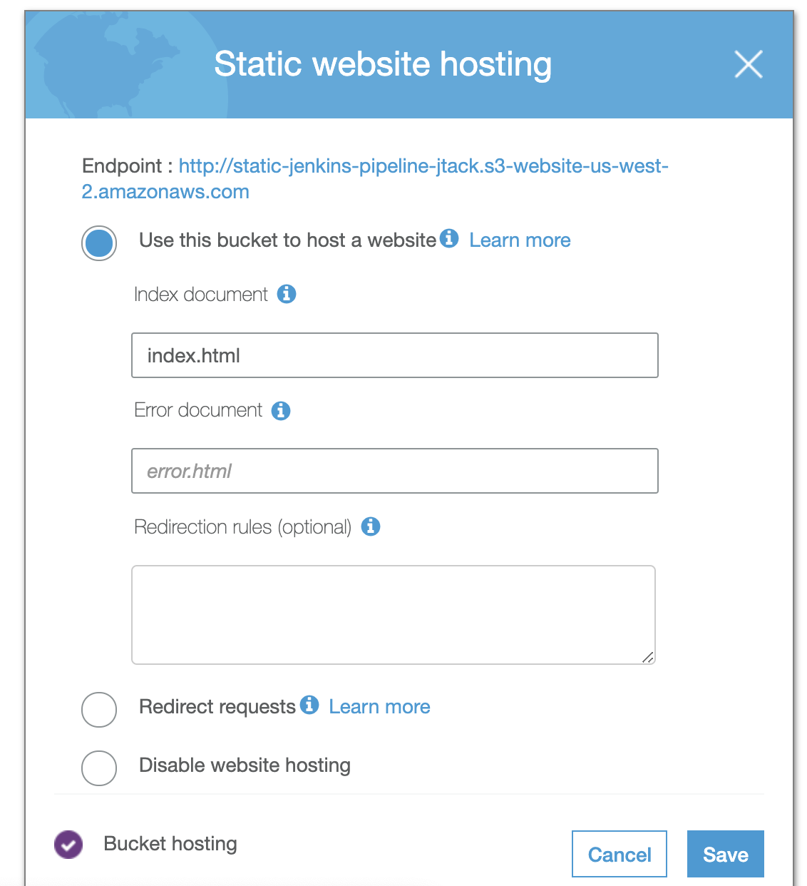
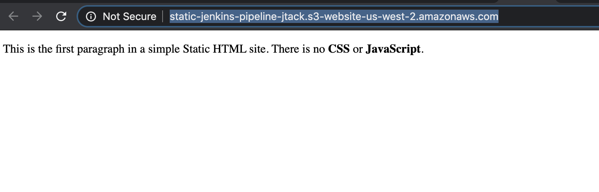

# Sample Jenkins Udacity Project

Udacity Cloud DevOps Engineer Project 4

## Prerequisites

* Jenkins Server with Linter Installed
* Blue Ocean Installed on Jenkins Server
* Jenkins Pipeline setup for current repo

This repo uses a Jenkins Pipeline to automagically deploy a static website to:

* Checkout code
* Run a Linter to catch code issues
* Do a Security Scan
* Deploy to Amazon AWS S3 bucket

Link to site: http://static-jenkins-pipeline-jtack.s3-website-us-west-2.amazonaws.com/

## Project Requirements

1. Setup IAM User:
	
	
2. Create EC2 T2.Micro, `ssh` into intance, and install Jenkins:
	
	
3. Setup EC2 Instance:
	
	
4. Install Blue Ocean:
	
	
5. Setup BlueOcean Pipeline via Jenkinsfile:
	
	
6. Setup S3 Bucket:
	
	
7. Make Bucket Public:
	
	
8. URL of Site:
	

